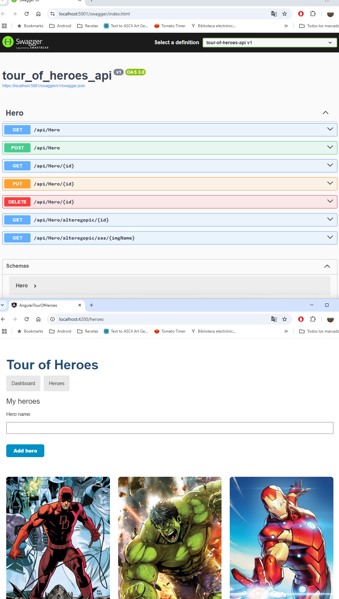
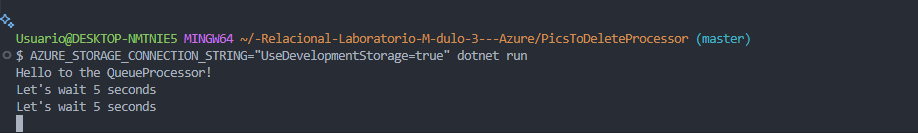
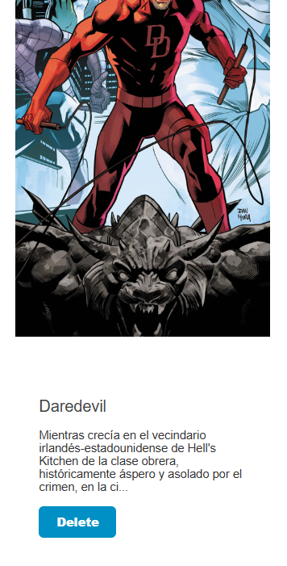
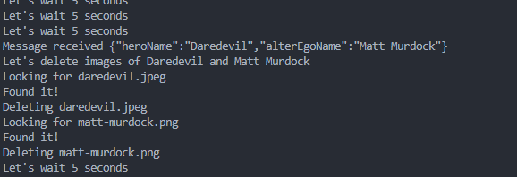

# Laboratorio Módulo 4 - Azure

App ejecutándose en localhost:

Por otro lado ejecutamos la cola pics-to-delete y vemos que permanece a la escucha:

Procedemos al borrado del heroe DareDevil:

Observamos que aparece el mensaje en la cola y procede al borrado de las imagenes ( el heroe lo busca por jpeg y el alterego por png)

